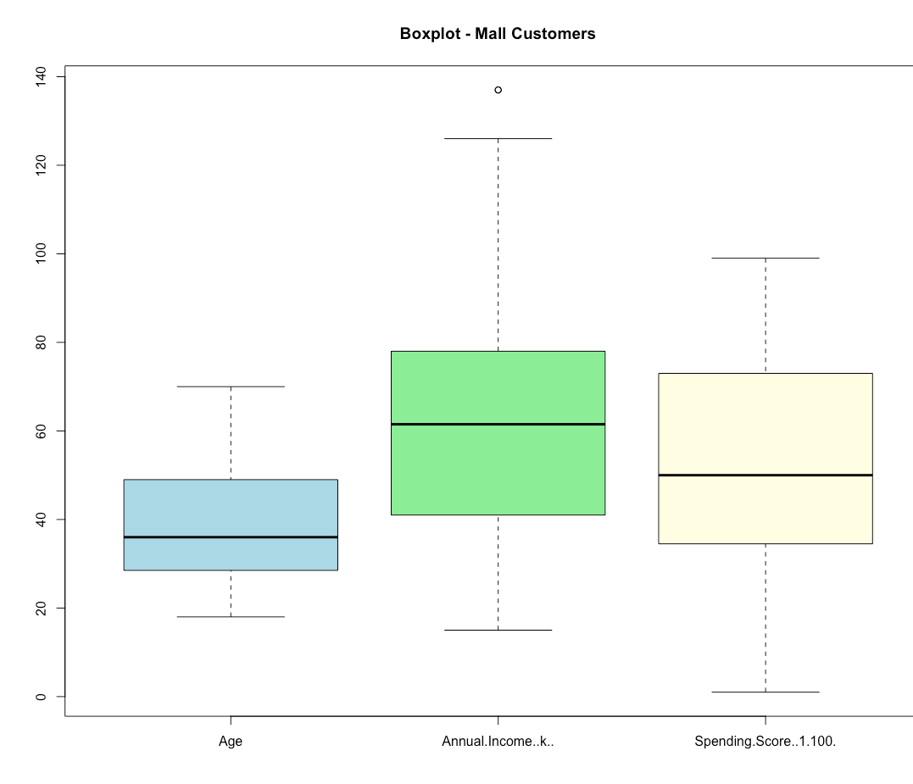
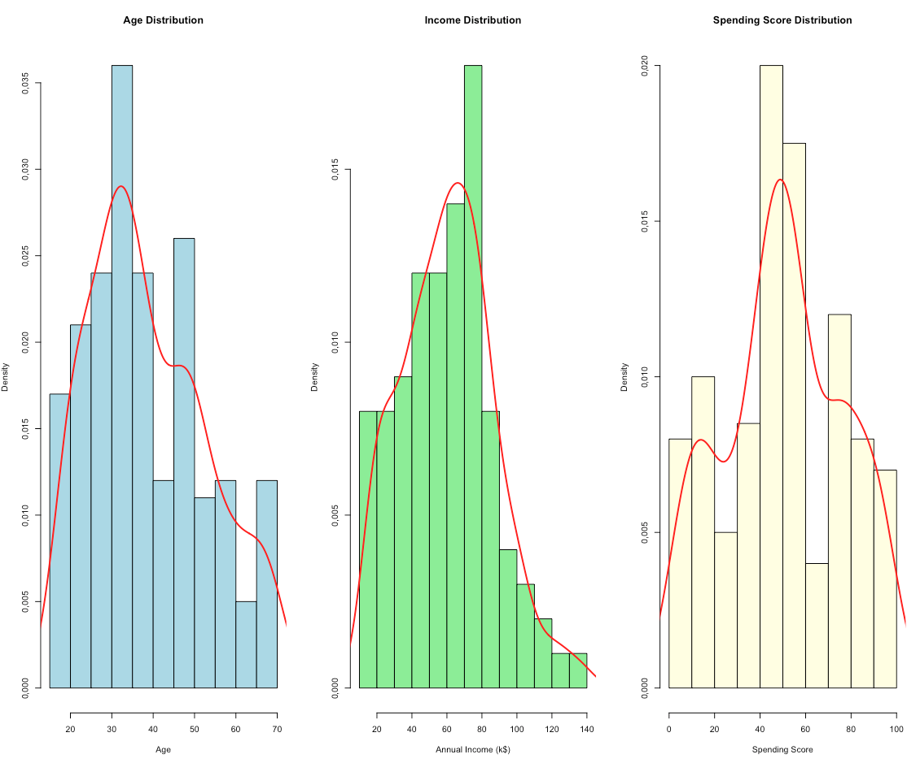

# Mall Customer Segmentation — Unsupervised Learning Project

# Project Overview

This project performs *customer segmentation* on mall shopping data using unsupervised machine learning techniques in R. The goal was to identify distinct customer groups based on their demographic and behavioral characteristics, enabling a marketing team to design targeted campaigns for each segment.

*Dataset:* [Mall Customer Segmentation Data](https://www.kaggle.com/datasets/vjchoudhary7/customer-segmentation-tutorial-in-python) from Kaggle  
*Language:* R  
*Key Libraries:* `factoextra`, `cluster`, `fossil`, `ggplot2`, `clusterSim`
*Techniques:* Z-score normalization, K-Means clustering, Ward's hierarchical clustering, PCA visualization, Adjusted Rand Index

## Dataset Description

| Variable | Description |
|---|---|
| Age | Customer age (years) |
| Annual Income | Annual income in thousands (k$) |
| Spending Score | Score assigned by the mall (1–100) based on purchasing behavior |

- *200 observations*
- *No missing values*

## Methodology

### Step 1 — Exploratory Data Analysis

Before any modelling, I explored the distributions of all three variables using **boxplots** and **histograms with density curves** to check for outliers and assess data shape.





*Key findings:*
- Annual Income has one mild outlier (~137k$) but nothing extreme
- All three distributions are roughly similar to normal distribution
- No significant skewness observed

---

### Step 2 — Data Normalization

Since the three variables are on different scales (Age: 18–70, Income: 15–137k$, Spending Score: 1–100), normalization was required to prevent any single variable from dominating the distance calculations.

*Method chosen: Z-score Standardization*

Z-score standardization was selected because the data appeared normally distributed with no significant outliers — confirmed by the EDA step above.

---

### Step 3 — Optimal Number of Clusters

Three methods were used to determine the optimal number of clusters:

*Elbow Method (WSS):*

[Elbow Method](images/03_elbow.png)

The curve flattens significantly around **k = 6**, suggesting diminishing returns beyond that point.

---

*Silhouette Method:*

[Silhouette Method](images/04_silhouette.png)

Two values tied at 0.43 — clusters **6 and 8**. When methods tie, the simpler solution (fewer clusters) is preferred for better business interpretability.

---

*Gap Statistic:*

[Gap Statistic](images/05_gap_statistic.png)

The largest gap is clearly at **k = 6**, confirming it as the optimal choice.

*Verdict: k = 6 clusters* — confirmed by 2 out of 3 methods, with Silhouette supporting either 6 or 8.

---

### Step 4 — K-Means Clustering (k=6)

K-means was chosen because:
- All variables are *numerical* — k-means works natively with numerical data
- *No significant outliers* — k-means is appropriate (not sensitive to outliers here)
- *Clear centroids* — easy to interpret and communicate to business stakeholders
- `nstart = 25` was used to ensure stability across random initializations

*Cluster Visualization (PCA space -> 77.6% variance explained):*

[K-Means Clusters](images/06_kmeans_clusters.png)

*Customer Segment Profiles:*

| Cluster | Age | Income (k$) | Spending Score | Profile |
|---|---|---|---|---|
| 1 | 56 | 54 | 49 | Middle-aged, average everything |
| 2 | 25 | 26 | 77 | Young impulsive spenders |
| 3 | 33 | 87 | 82 | Prime targets — young, rich, high spenders |
| 4 | 42 | 89 | 17 | Wealthy but cautious — untapped potential |
| 5 | 27 | 58 | 48 | Average young customers |
| 6 | 46 | 26 | 19 | Budget conscious — low income, low spending |

---

### Step 5 — Validation with Ward's Hierarchical Clustering

To validate the k-means results, *Ward's hierarchical clustering* was applied using Euclidean distance.

*Euclidean distance* was chosen because:
- All variables are continuous and numerical
- No significant outliers present (Manhattan would be preferred otherwise)
- Ward's method + Euclidean = classic, well-established combination in literature

*Dendrogram:*

[Dendrogram](images/07_ward_dendrogram.png)

*Ward Cluster Visualization:*

[Ward Clusters](images/08_ward_clusters.png)

*Adjusted Rand Index (ARI) comparison:*

| Metric | Value | Interpretation |
|---|---|---|
| Adjusted Rand Index | *0.88* | Both methods agreed on 88% of cases |

An ARI of 0.88 confirms that the *6-cluster segmentation is stable and robust* — it is not an artifact of the algorithm choice.

---

## Business Insights & Recommendations

Based on the segmentation, three clusters stand out for marketing strategy:

*Priority 1 — Cluster 3 (Prime Targets)*
Young (avg. 33), high income ($87k), high spending (82). These are the ideal customers for *premium product campaigns*. High engagement and high conversion potential.

*Priority 2 — Cluster 4 (Untapped Potential)*
Middle-aged (avg. 42), very high income ($89k) but very low spending (17). These customers have the financial capacity but are not engaged. A *loyalty program or personalized outreach* could unlock significant revenue.

*Low Priority — Cluster 6 (Budget Conscious)*
Older (avg. 46), low income ($26k), low spending (19). Limited conversion potential. Best served with *discount-focused or value messaging* if targeted at all.

---

## Repository Structure

```
mall-customer-segmentation/
│
├── README.md
├── mall_clustering.R       # Full analysis script
├── Mall_Customers.csv      # Dataset
└── images/                 # All plots and visualizations
    ├── 01_boxplot.png
    ├── 02_histograms.png
    ├── 03_elbow.png
    ├── 04_silhouette.png
    ├── 05_gap_statistic.png
    ├── 06_kmeans_clusters.png
    ├── 07_ward_dendrogram.png
    └── 08_ward_clusters.png
```
